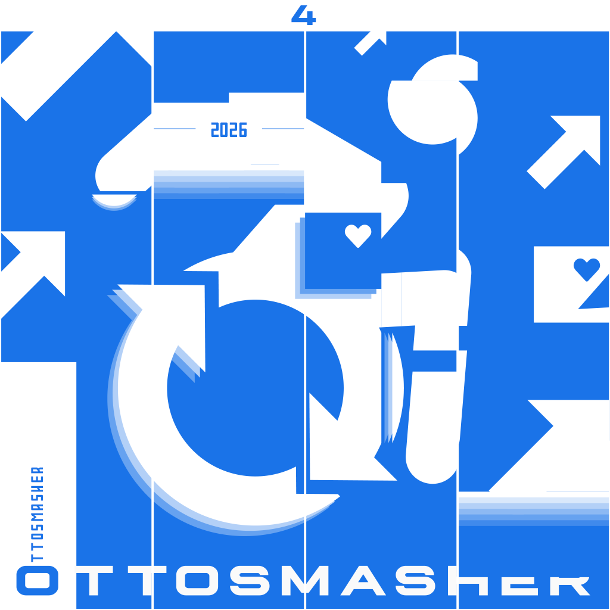

  

<h1 align="center">OttoSmasher</h1>

把日语对白变成可检索、可试听、可制作的音 MAD 素材。

  <a href="https://github.com/Axolyz/OttoSmasher/releases/latest">下载</a> ·
  <a href="#快速开始">快速开始</a> ·
  <a href="https://github.com/Axolyz/OttoSmasher/issues">反馈问题</a> ·
  <a href="LICENSE">GPL-3.0-or-later</a>

OttoSmasher 是本地运行的音频素材工作站。以原片、声音资产、时间标注和采样为基础，保留每个成品的实际音源及时间关系。界面以中文为主，语音对齐面向日语。

## 功能

- **原片与采样管理**：原生音视频播放、波形选区、星标、标签、保存筛选器及批量编辑。
- **语音分析与搜索**：narabas、HubertFA、pydomino 音素对齐，FCPE 音高分析，节奏与音高检索；搜索结果可固定保存。
- **字幕取样**：独立导入字幕标记，再按需分批创建台词或音效采样；支持轨道角色及前后容差。
- **音频制作**：截取、拉平、卡拍、导出及外部成品回导；拉平支持首元音起点、内部保留和左右交界定音。
- **外部分离**：调用本机 PyMSS Studio 已安装的运行环境和已下载模型。

## 快速开始

### 1. 下载并启动

在 [Releases](https://github.com/Axolyz/OttoSmasher/releases) 下载 **standard** 应用压缩包：

| 系统 | 文件 |
| --- | --- |
| macOS 14 或更新版本，Apple Silicon | `OttoSmasher-1.0.0-mac-arm64.zip` |
| Windows 10/11，x64 | `OttoSmasher-1.0.0-win-x64.zip` |

解压完整压缩包。macOS 将 `OttoSmasher.app` 放入应用程序目录；Windows 打开解压目录中的 `OttoSmasher.exe`。首次启动需要在用户目录释放运行库，请等待初始化完成。

应用包含 Python、ONNX Runtime、媒体工具、播放器、G2P 辞典、tokenizer 和模型配置；**不需要自行安装 Python、Node.js 或 PyTorch**。应用不包含 ONNX 权重、用户素材和 PyMSS Studio。

当前应用未配置开发者签名/公证；系统可能显示未知开发者提示。请核对下载来源和 Release 中的 SHA-256。macOS Intel 与 Linux 暂无发布包。

### 2. 放置模型

取得单独分发的 `OttoSmasher-1.0.0-models.zip`。权重包由项目维护者另行提供，不包含在应用下载中。

1. 启动应用，打开设置中的**运行环境／模型状态**，查看模型文件的完整路径。
2. 将模型包内的 `models` 目录合并到该路径对应的工作区根目录，保留子目录结构；不要放入 `.app` 或程序资源目录，也不要形成 `models/models`。
3. 刷新环境检测，确认六类模型文件就位。首次实际使用后才会出现对应的模型实测结果。

模型包只包含当前使用的 narabas、HubertFA、pydomino、FCPE、PC-NSF-HiFiGAN、tsqyomi 及对应支持文件。不会包含 Qwen、Yohane、旧内置分离或其他实验权重。包内提供文件清单与校验值。

### 3. 配置 PyMSS Studio

自行安装 PyMSS Studio，并在 Studio 内完成运行环境配置及所需分离模型的下载。回到 OttoSmasher 设置，检查 Studio 安装目录、数据目录和可用模型；自动检测不到时手动指定。

仅导入、试听、检索和拉平时不需要运行分离。需要分离时，Studio 的模型与运行库必须先准备好；OttoSmasher 不会替 Studio 安装依赖或偷偷换用其他模型。

### 4. 开始制作

导入原片 → 按需导入字幕标记或准备分离轨 → 截取／从字幕建立采样 → 分析与检索 → 拉平、卡拍和导出。

没有字幕也可以导入、试听和手动截取。外部成品回导只需确定选区起点，终点按文件时长计算，不能超过实际声音资产边界。

## 设备与数据

默认 CPU 推理。可在设置显式启用 Windows DirectML 或 macOS CoreML；后端支持、探测成功和模型实测是不同状态，部分算子仍可能在 CPU 执行。Windows DirectML 的具体硬件表现仍需要实机反馈。

用户数据与应用分开保存。更新应用不会要求覆盖素材库；备份时应包含工作区数据库、媒体及模型。删除采样登记不等于删除原文件，模型结果也不等于人工确认。

## 源码开发

源码仓库保留维护所需的测试和构建脚本，它们不是最终用户需要安装的运行环境。过程报告和旧示例不作为发布文档。

- macOS：`./scripts/bootstrap.sh`，之后按 [构建说明](docs/DISTRIBUTION.md) 准备 ONNX 与原生播放器。
- Windows：使用 `scripts/setup_windows.ps1`；原生模块编译需要 Visual Studio C++ Build Tools。
- 前端：`pnpm --dir desktop install --frozen-lockfile`、`pnpm --dir desktop build`。
- 测试：`PYTHONPATH=src .runtime/envs/core/bin/python -m pytest -q`、`node --test desktop/tests/*.test.cjs`。

正式应用通过 [GitHub Actions](.github/workflows/build-apps.yml) 在各目标系统构建，发布只包含 standard；experiment 是源码开发入口。

## 反馈与贡献

请通过 [Issues](https://github.com/Axolyz/OttoSmasher/issues) 提供系统、CPU 架构、应用版本、复现步骤及错误日志。请先移除日志中的个人路径和私有素材信息，不要上传模型或无权分发的原片。

## 许可证与致谢

OttoSmasher 使用 [GPL-3.0-or-later](LICENSE)。感谢 ONNX Runtime、Electron、mpv、FFmpeg、Rubber Band、pyopenjtalk-plus、narabas、HubertFA、pydomino、FCPE、PC-NSF-HiFiGAN、tsqyomi 及 PyMSS Studio 的开发者。

第三方组件和模型保留各自许可，应用的 GPL 不替代它们。详见 [第三方声明](THIRD_PARTY_NOTICES.md)。
